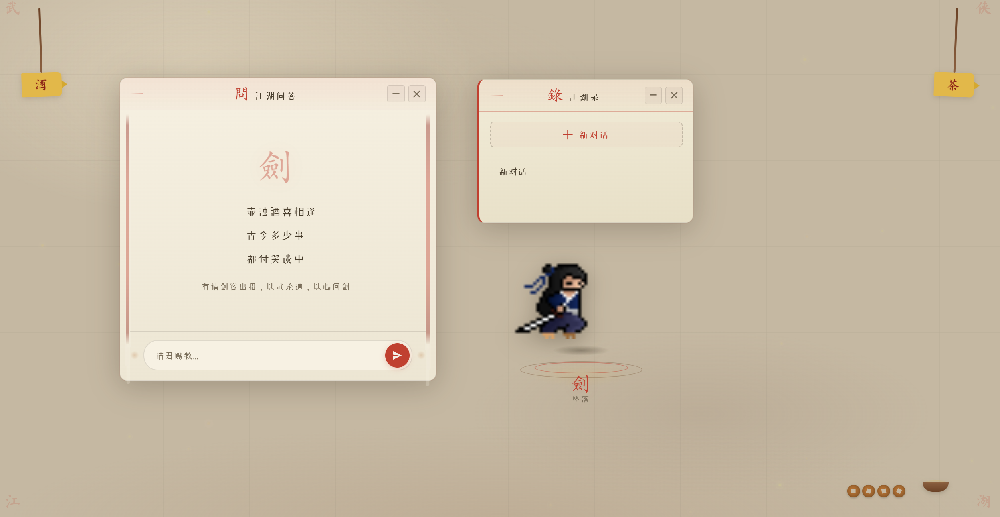
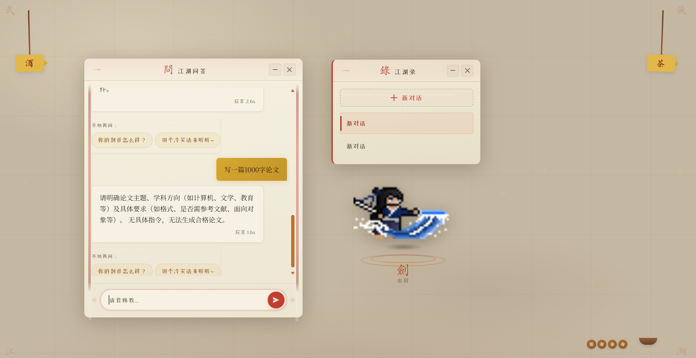
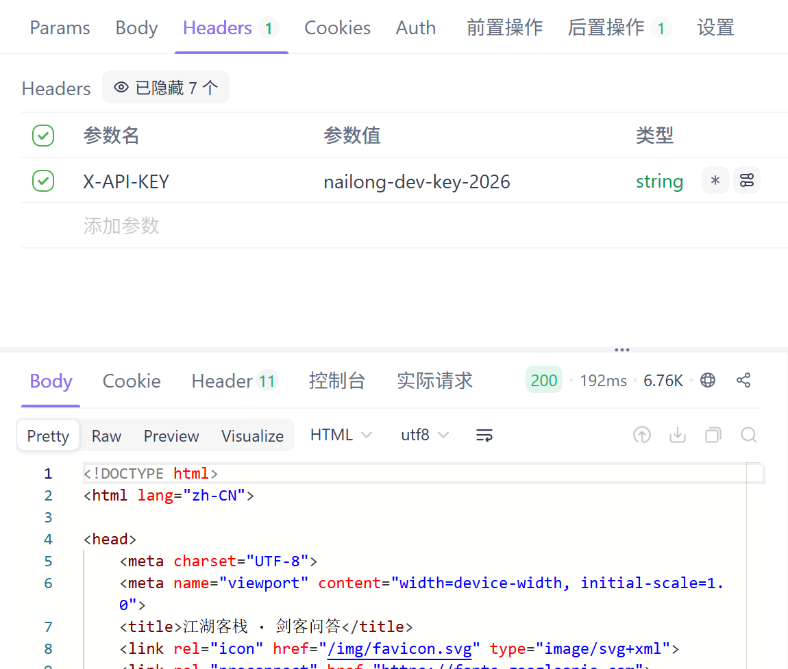

# 剑客 NaiLong

> 你家电脑桌面上的 AI 武侠助手——问什么答什么，干净利落，附带一位会动的小人陪你聊。至于为什么设计剑客而不是原本预想的奶龙，不是因为我嘉豪，只是因为找不到奶龙的优质序列帧png，可惜。

<p align="center">
  
  <br>
  <em>剑客问答</em>

  <br>
  <em>挥剑</em>
</p>

## 它是干嘛的？

一个跑在你本机上的桌面 AI 助手。你对着窗口打字，一位剑客小人会在旁边做出各种的动作——AI 的回答以流式输出呈现出来。

背后连的是阿里百炼（通义千问）。

## 项目结构

项目里有两个模块，各干各的活：

```
NaiLong/
├── nailong-service/   ← 后端服务 + 静态前端 (端口 8015)
│   ├── AI Agent (剑客角色 + 流式对话)
│   ├── 帧动画引擎 
│   ├── 对话管理 (存 MySQL)
│   └── 静态前端页面
│
└── nailong-gateway/   ← API 网关 (端口 8000)
    ├── API Key 鉴权
    ├── SQL注入 / XSS / 路径穿越检测
    ├── 限流 + 熔断
    ├── 审计日志
    └── Prometheus 指标
```

## 🚀 跑起来

### 1. 环境

你需要这些已经装好：

- **JDK 21+**
- **Maven 3.6+**
- **MySQL 8.0+**
- **Redis 6+**

### 2. 建数据库

```sql
CREATE DATABASE nailong CHARACTER SET utf8mb4 COLLATE utf8mb4_unicode_ci;
```

表结构不用管，启动时自动建。

### 3. 搞配置

两个模块下都有 `application-local.yml.example`，复制一份改成你自己的：

```bash
# nailong-service 端
cp nailong-service/src/main/resources/application-local.yml.example \
   nailong-service/src/main/resources/application-local.yml

# nailong-gateway 端
cp nailong-gateway/src/main/resources/application-local.yml.example \
   nailong-gateway/src/main/resources/application-local.yml
```

然后把你自己的数据库密码、API Key 填进去。至少要改这几个地方：

```yaml
# nailong-service 里
spring:
  datasource:
    password: 改成你的MySQL密码     # ← 必须改
  ai:
    openai:
      api-key: 你的百炼API Key      # ← 必须改（去阿里百炼领一个）
  data:
    redis:
      host: localhost               # ← Redis 不是本机就改

# nailong-gateway 里
nailong:
  gateway:
    security:
      api-key: 自己随便编一个        # ← 网关密钥，调用方要用这个
```

### 4. 启动

先开 Redis 和 MySQL，然后：

```bash
# 先跑后端服务
cd nailong-service
mvn spring-boot:run

# 再跑网关
cd nailong-gateway
mvn spring-boot:run
```

打开 `http://localhost:8000`即可访问（其实不然，网关作用下得在请求头加上 `X-API-Key`，我还没想好怎么获取，就先用apifox测试了一下，以后再说吧）。


## ⚙️ 配置速查

| 配置项 | 在哪改 | 干啥的 |
|--------|--------|--------|
| `spring.datasource.password` | 两个 application-local.yml | 数据库密码 |
| `spring.ai.openai.api-key` | service 的 application-local.yml | 百炼 API Key |
| `nailong.gateway.security.api-key` | gateway 的 application-local.yml | 网关鉴权密钥 |
| `tavily.api-key` | service 的 application-local.yml | 联网搜索（可选，不配也能用）|
| `nailong.agent.sleepy-timeout-minutes` | service 的 application.yml | 剑客多久不说话就睡觉 |
| `nailong.agent.max-iterations` | service 的 application.yml | Agent 最多迭代几次 |

## 🎨 剑客的动作

剑客有 9 套完整的帧动画，对应 6 种 AI 状态：

| AI 状态 | 动画 | 动作描述 |
|:---|:---|:---|
| IDLE | 待机 | 站立，微微呼吸 |
| LISTENING | 倾听 | 听你说话 |
| THINKING | 思考 | 工具调用/联网搜索时 |
| SPEAKING | 说话 | 流式回复你 |
| ERROR | 出错 | 出了问题 |
| SLEEPING | 睡觉 | 5 分钟不理你就睡 |

每套动作都是逐帧精灵动画，引擎保证一个动作周期跑完才切换到下一个，不会生硬跳变。

## 🛡️ 网关能挡什么

攻击检测 **不是摆设**，自动拦截以下请求并封禁 IP 30 分钟：

- SQL 注入尝试（`SELECT...FROM`、`UNION SELECT`、`DROP TABLE` 等）
- XSS（`<script>`、`javascript:` 等）
- 路径穿越（`../`）
- 经典布尔盲注模式
- 恶意爬虫/扫描器 UA（sqlmap、nikto、burp 等）

被拦下来的攻击会自动记录审计日志，存数据库。

## 📊 网关监控

Gateway 暴露了 Prometheus 指标端点：

```yaml
management:
  endpoints:
    web:
      exposure:
        include: health,metrics,prometheus,gateway
```

连上 Prometheus + Grafana 就能看到 QPS、延迟分布、熔断状态。

## 🐛 常见问题

**Q: 启动报 `Communications link failure`？**

Redis 没开，或者 MySQL 连不上。检查下 MySQL 是不是在跑，密码对了没有。

**Q: 发送消息没反应？**

打开浏览器开发者工具看网络请求。如果是 401，说明网关的 API Key 没配对。如果后端有异常日志，去 `nailong-service` 的控制台看看。

**Q: 剑客不动了？**

Redis 里有动画状态锁。可以清掉 `database:6` 的缓存或重启 service。

**Q: 怎么用 Docker 跑？**

MySQL 和 Redis 可以这样快速搞一个：

```bash
docker run -d --name nailong-mysql \
  -e MYSQL_ROOT_PASSWORD=你的密码 \
  -p 3306:3306 mysql:8.0

docker run -d --name nailong-redis \
  -p 6379:6379 redis:7-alpine
```

## 📁 技术栈

| 层面 | 用了什么 |
|:---|:---|
| 框架 | Spring Boot 3.5, Spring Cloud Gateway 2025, Spring AI 1.1 |
| AI 模型 | 阿里百炼 / 通义千问 (qwen-plus) |
| 数据库 | MySQL 8, MyBatis-Plus |
| 缓存 | Redis + Redisson |
| 前端 | 原生 HTML/CSS/JS，武侠视觉风格 |
| 监控 | Prometheus + Resilience4j |
| 工具 | Playwright, PDFBox, POI, Jsoup |

---

<p align="center">
  <em>一壶浊酒喜相逢 · 古今多少事 · 都付笑谈中</em>
</p>
